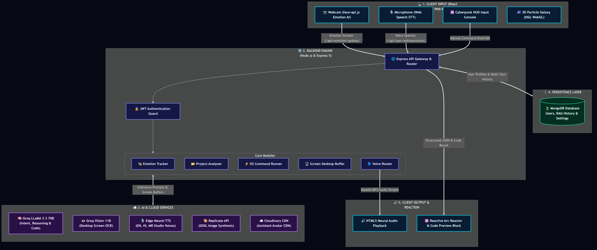
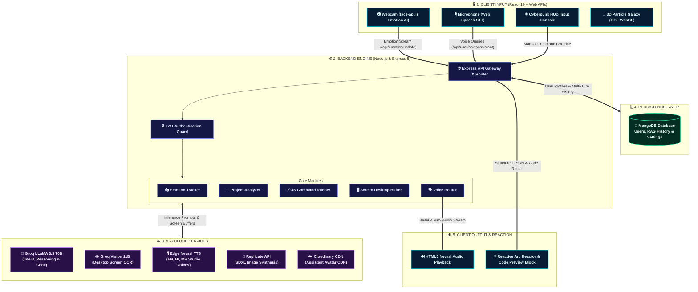

# 🤖 J.A.R.V.I.S. — Multimodal Context-Aware AI Developer Assistant

<p align="center">
  
  
  
  
  
  
  
</p>

<p align="center">
  <strong>An Iron Man-inspired, context-aware desktop AI pair programmer engineered for modern developers.</strong><br>
  Featuring real-time facial emotion recognition, multilingual neural voice synthesis, deep local workspace indexing, desktop screen vision, and autonomous OS terminal execution.
</p>

---

## 📑 Table of Contents

- [Overview](#-overview)
- [Key Features](#-key-features)
- [System Architecture](#-system-architecture)
- [Technology Stack](#-technology-stack)
- [Project Directory Structure](#-project-directory-structure)
- [Getting Started](#-getting-started)
  - [Prerequisites](#prerequisites)
  - [Backend Setup](#1-backend-setup)
  - [Frontend Setup](#2-frontend-setup)
  - [Face Recognition Models](#3-face-recognition-models)
- [Configuration & Environment Variables](#-configuration--environment-variables)
- [Voice Commands & Usage Examples](#-voice-commands--usage-examples)
- [REST API Reference](#-rest-api-reference)
- [Troubleshooting & FAQs](#-troubleshooting--faqs)
- [Roadmap](#-roadmap)
- [Author & Acknowledgments](#-author--acknowledgments)
- [License](#-license)

---

## 🌟 Overview

Modern software development is heavily fragmented. Engineers constantly context-switch between code editors, terminals, documentation tabs, and generic AI chat interfaces that have zero understanding of their local codebase or physical state.

**J.A.R.V.I.S. (Just A Rather Very Intelligent System)** solves this friction by operating directly inside your local environment as a full-stack, multimodal companion:

1. **Emotion-Aware Interaction:** Watches and understands your emotional state via your webcam and smoothly adapts its tone (supportive when you're frustrated, energetic when you're happy).
2. **Deep Local Project Awareness:** Scans and indexes entire workspaces recursively, detecting frameworks, parsing dependencies, and fetching relevant files automatically.
3. **Hyper-Realistic Neural Speech:** Powered by Microsoft Edge Neural voices in English, Hindi, and Marathi, with a built-in phonetic normalization dictionary for technical developer terms.
4. **Desktop Screen Vision & OS Automation:** Analyzes what's on your screen using Groq Vision and executes authorized Linux shell tasks (like spinning up dev servers or launching IDEs) directly from voice prompts.
5. **Cyberpunk Arc Reactor HUD:** Features an interactive 3D WebGL particle galaxy and an Iron Man-style Arc Reactor that reacts dynamically to voice and speech.

---

## ✨ Key Features

### 🧠 1. Ultra-Fast LLM Reasoning & Vision Engine
- Powered by **Groq Cloud API** running `llama-3.3-70b-versatile` for sub-second intent parsing, code generation, and developer conversational reasoning.
- Integrated with `llama-3.2-11b-vision-preview` for inspecting desktop screenshots to perform live debugging and code reviews.
- Structured JSON pipeline guaranteeing predictable command routing and natural speech outputs.

### 🎭 2. Real-Time Facial Emotion Recognition (Computer Vision)
- In-browser neural vision using **`face-api.js`** (TensorFlow.js) with `tiny_face_detector` and `face_expression_model`.
- Scans facial expressions through a Picture-in-Picture webcam HUD with rolling 5-frame smoothing to eliminate jitter.
- Tracks emotional trends (`Happy`, `Sad`, `Angry`, `Neutral`, `Surprise`, `Fearful`, `Disgust`) and synchronizes state with backend memory to adapt assistant personality in real time.

### 🎙️ 3. Multilingual Neural Speech Pipeline (TTS & STT)
- Studio-quality voice generation via **`node-edge-tts`** using high-fidelity neural voices:
  - 🇺🇸 **English:** `en-US-AndrewNeural`
  - 🇮🇳 **Hindi:** `hi-IN-SwaraNeural`
  - 🚩 **Marathi:** `mr-IN-AarohiNeural`
- **Phonetic Normalization Dictionary:** Intercepts technical terms (e.g., `API`, `GPU`, `React`, `Node`, `GitHub`) before synthesis to prevent regional TTS voice engines from mispronouncing English programming terms.
- Built-in fallback to native browser Web Speech API if offline or on limited connections.

### 📂 4. Local Codebase Analyzer & Context Engine
- Scans local directories recursively, smartly excluding bloat (`node_modules`, `.git`, `dist`, `build`).
- Calculates project metrics (total files, directories, size in MB) and detects frameworks (**React, Next.js, Express, Vue, Angular**).
- Context-retrieval module identifies and reads the most relevant project files matching the user's natural language request.

### ⚡ 5. Autonomous OS Automation & Shell Commands
- Direct local Linux system interaction through Node.js `child_process.exec`.
- Executes terminal commands triggered by conversational voice inputs (e.g., *"Open VS Code"*, *"Run dev server"*, *"Create a React app"*).

### 🖥️ 6. Desktop Screen Vision
- Instant screen capture using `screenshot-desktop` buffer streaming.
- Passes the base64 framebuffer to Groq Vision models to summarize current windows, error logs, or UI layouts.

### 🎨 7. Interactive Cyberpunk Arc Reactor UI
- Built with **React 19**, **Vite**, and **Tailwind CSS v4**.
- **Interactive 3D Galaxy:** WebGL particle background powered by **OGL** with mouse-following gravitational velocity.
- **Dynamic Arc Reactor:** Precision SVG and CSS animation featuring rotating tick rings, core containment glow, pulsing audio visualizer, and code output panels.

### 🔐 8. Authentication & Custom Assistants
- Secure JWT cookie-based session management and Bcrypt password hashing.
- Cloudinary integration allowing users to customize their assistant's avatar and branding.
- Persistent conversation history stored in MongoDB for contextual memory recall.

---

## 🏗️ System Architecture

<p align="center">
  
</p>

<details>
<summary><b>🔍 Click to view interactive Mermaid diagram source</b></summary>



</details>

### 🔁 End-to-End Execution Flow

```text
[User Speaks / Shows Emotion]
         │
         ├───► Webcam Feed ────────► face-api.js (Local TF.js) ──► Emotion: "Sad" (Confidence: 94%)
         │                                                              │
         └───► Microphone ─────────► Web Speech API ────────────────────┼─► Text: "Analyze this project"
                                                                        │
                                                                        ▼
                                                       [POST /api/user/asktoassistant]
                                                                        │
                                         ┌──────────────────────────────┴─────────────────────────────┐
                                         ▼                                                           ▼
                             [Project Analyzer Service]                                   [Groq Cloud Inference]
                             Scans directory tree, deps,                                 Llama 3.3 70B receives:
                             and detects framework (React)                               - Query: "Analyze this project"
                                         │                                               - Emotion: "Sad" (gentle tone)
                                         │                                               - Framework Context
                                         └──────────────────────────────┬─────────────────────────────┘
                                                                        ▼
                                                        Returns Structured JSON:
                                                        - type: "project-analyze"
                                                        - response: "Project analyzed. 42 files found..."
                                                        - language: "en-US"
                                                                        │
                                                                        ▼
                                                          [Edge Neural Voice Engine]
                                                          Pronunciation Dictionary
                                                          Normalizes developer acronyms
                                                                        │
                                                                        ▼
                                                            Base64 Audio Stream (.mp3)
                                                                        │
                                                                        ▼
                                                          [Frontend Arc Reactor HUD]
                                                          - Plays studio-quality voice
                                                          - Core reactive pulse animation
                                                          - Displays metrics in HUD
```

---

## 💻 Technology Stack

| Domain | Technologies & Libraries |
| :--- | :--- |
| **Frontend Framework** | [React 19](https://react.dev/), [Vite](https://vitejs.dev/), [React Router DOM v7](https://reactrouter.com/) |
| **Styling & HUD** | [Tailwind CSS v4](https://tailwindcss.com/), Custom Cyberpunk CSS Animations |
| **3D Graphics & Visuals** | [OGL](https://github.com/oframe/ogl) (Lightweight WebGL Library), Custom Canvas Particle Shaders |
| **Computer Vision (Client)** | [face-api.js](https://github.com/justadudewhohacks/face-api.js/) (TensorFlow.js models) |
| **Backend Runtime** | [Node.js](https://nodejs.org/), [Express.js v5](https://expressjs.com/) |
| **Database & ODM** | [MongoDB](https://www.mongodb.com/), [Mongoose v8](https://mongoosejs.com/) |
| **Reasoning LLM** | [Groq Cloud API](https://groq.com/) — `llama-3.3-70b-versatile` |
| **Vision LLM** | [Groq Cloud API](https://groq.com/) — `llama-3.2-11b-vision-preview` |
| **Neural Voice Synthesis** | [node-edge-tts](https://github.com/schroffl/node-edge-tts) (Microsoft Edge Neural Voices) |
| **Desktop Automation** | Node.js `child_process`, [screenshot-desktop](https://github.com/bencevans/screenshot-desktop) |
| **Authentication & Media** | [JWT](https://jwt.io/), [Bcrypt.js](https://github.com/dcodeIO/bcrypt.js), [Multer](https://github.com/expressjs/multer), [Cloudinary](https://cloudinary.com/) |
| **Image Generation** | [Replicate API](https://replicate.com/) (SDXL) |

---

## 📁 Project Directory Structure

```text
jarvis/
└── J.A.R.I.V.S-ASSISTANT/
    ├── backend/                          # Express.js Server & AI Services
    │   ├── config/
    │   │   ├── cloundinary.js            # Cloudinary asset storage config
    │   │   └── db.js                     # MongoDB connection bootstrap
    │   ├── controllers/
    │   │   ├── auth.controller.js        # Sign Up, Sign In, Cookie Logout
    │   │   ├── command.controller.js     # Native OS command runner
    │   │   ├── imageController.js        # AI image generation endpoint
    │   │   ├── project.controller.js     # Local directory analyzer controller
    │   │   ├── user.controller.js        # Assistant queries & user profiles
    │   │   └── vision.controller.js      # Screenshot & Groq Vision analysis
    │   ├── middleware/
    │   │   ├── isAuth.js                 # JWT cookie authentication guard
    │   │   └── multer.js                 # File upload buffer handler
    │   ├── models/
    │   │   └── user.model.js             # Mongoose user & history schema
    │   ├── routes/
    │   │   ├── auth.routes.js            # /api/auth
    │   │   ├── command.route.js          # /api/command
    │   │   ├── emotion.route.js          # /api/emotion
    │   │   ├── imageRoutes.js            # /api/image
    │   │   ├── project.route.js          # /api/project
    │   │   ├── user.routes.js            # /api/user
    │   │   ├── vision.route.js           # /api/vision
    │   │   └── voice.route.js            # /api/voice
    │   ├── services/
    │   │   ├── analyzer/
    │   │   │   └── projectAnalyzer.service.js # Recursive file indexer
    │   │   ├── context/
    │   │   │   └── context.service.js         # Semantic context file matcher
    │   │   ├── emotion/
    │   │   │   ├── emotion.service.js         # Emotion state bridge
    │   │   │   └── emotionMemory.js           # Session emotion state tracker
    │   │   └── voice/
    │   │       ├── edgeTTS.js                 # Microsoft Edge Neural TTS generator
    │   │       ├── pronunciationDictionary.js # Phonetic dictionary for dev acronyms
    │   │       └── voiceRouter.js             # TTS engine selector
    │   ├── .env.example                  # Environment configuration template
    │   ├── gemini.js                     # Groq LLM orchestration & prompt pipeline
    │   ├── index.js                      # Express server entry point
    │   └── package.json                  # Backend dependencies
    │
    ├── frontend/                         # React 19 Client with Vite & Tailwind
    │   ├── public/
    │   │   └── models/                   # face-api.js neural model weights
    │   ├── src/
    │   │   ├── assets/                   # Static images and branding
    │   │   ├── components/
    │   │   │   ├── Card.jsx              # Avatar selection cards
    │   │   │   ├── EmotionPanel.jsx      # Live webcam PiP & emotion HUD
    │   │   │   ├── Galaxy.jsx            # Interactive WebGL 3D particle canvas
    │   │   │   └── Galaxy.css            # Canvas styling rules
    │   │   ├── context/
    │   │   │   └── UserContext.jsx       # Global user session & API context
    │   │   ├── pages/
    │   │   │   ├── Customize.jsx         # Initial assistant creation setup
    │   │   │   ├── Customize2.jsx        # Avatar selection & image upload
    │   │   │   ├── Home.jsx              # Core HUD, Arc Reactor & Voice Console
    │   │   │   ├── SignIn.jsx            # User authentication sign-in
    │   │   │   └── SignUp.jsx            # New account registration
    │   │   ├── services/
    │   │   │   └── emotionDetector.js    # face-api.js detection lifecycle
    │   │   ├── App.jsx                   # Application routing structure
    │   │   ├── index.css                 # Cyberpunk animations & Tailwind setup
    │   │   └── main.jsx                  # React DOM entry point
    │   ├── package.json                  # Frontend dependencies
    │   └── vite.config.js                # Vite build configuration
    │
    └── README.md                         # Project documentation
```

---

## 🚀 Getting Started

Follow these steps to set up and run J.A.R.V.I.S. locally on your machine.

### Prerequisites

Ensure you have the following installed on your system:
- **Node.js**: `v18.0.0` or higher ([Download](https://nodejs.org/))
- **npm** or **yarn**
- **MongoDB**: Local instance running on port `27017` or a MongoDB Atlas URI ([Download](https://www.mongodb.com/try/download/community))
- **Webcam & Microphone**: Required for emotion detection and voice commands.
- **Operating System**: Linux is recommended for full OS terminal command execution capabilities; Windows/macOS supported for general AI and web features.

---

### 1. Backend Setup

```bash
# Navigate to the backend directory
cd backend

# Install dependencies
npm install

# Create your .env configuration file
cp .env.example .env
```

Open `backend/.env` and insert your credentials:

```env
PORT=3000
MONGODB_URL=mongodb://127.0.0.1:27017/virtualassistant
JWT_SECRET=your_super_secret_jwt_key_here
GROQ_API_KEY=gsk_your_groq_api_key_here
CLOUDINARY_CLOUD_NAME=your_cloudinary_cloud_name
CLOUDINARY_API_KEY=your_cloudinary_api_key
CLOUDINARY_API_SECRET=your_cloudinary_api_secret
REPLICATE_API_TOKEN=your_optional_replicate_token
```

> 🔑 **Need a free Groq API key?** Grab one in seconds from [console.groq.com](https://console.groq.com/).

Start the backend server in development mode:

```bash
npm run dev
```

The server will initialize on `http://localhost:3000`.

---

### 2. Frontend Setup

In a new terminal window:

```bash
# Navigate to the frontend directory
cd frontend

# Install dependencies
npm install

# Start the Vite development server
npm run dev
```

The client application will start at `http://localhost:5173`.

---

### 3. Face Recognition Models

The facial emotion detection relies on lightweight neural network weights. Verify that the model weight files are present in your `frontend/public/models/` directory:
- `tiny_face_detector_model-weights_manifest.json`
- `tiny_face_detector_model-shard1`
- `face_expression_model-weights_manifest.json`
- `face_expression_model-shard1`

*(If not already downloaded, these can be fetched from the official [face-api.js weights repository](https://github.com/justadudewhohacks/face-api.js/tree/master/weights)).*

---

## ⚙️ Configuration & Environment Variables

| Variable | Description | Required | Example |
| :--- | :--- | :---: | :--- |
| `PORT` | Port for the Express server to listen on | Yes | `3000` |
| `MONGODB_URL` | MongoDB connection URI | Yes | `mongodb://127.0.0.1:27017/virtualassistant` |
| `JWT_SECRET` | Secret string for signing authentication tokens | Yes | `c87f98e7...` |
| `GROQ_API_KEY` | API key from Groq Cloud for fast Llama reasoning | Yes | `gsk_...` |
| `CLOUDINARY_CLOUD_NAME` | Cloudinary cloud identifier for avatar storage | Yes | `my_cloud` |
| `CLOUDINARY_API_KEY` | Cloudinary API Key | Yes | `123456789...` |
| `CLOUDINARY_API_SECRET`| Cloudinary API Secret | Yes | `abcdef...` |
| `REPLICATE_API_TOKEN` | Replicate token for AI image generation (SDXL) | Optional | `r8_...` |

---

## 🗣️ Voice Commands & Usage Examples

Speak directly to J.A.R.V.I.S. or enter commands into the manual command override prompt:

| Category | Example Voice Prompt | What J.A.R.V.I.S. Does |
| :--- | :--- | :--- |
| **Project Analysis** | *"Scan this project and check the architecture"* | Recursively maps files, detects frameworks (e.g. React/Express), and speaks the summary. |
| **Screen Vision** | *"Jarvis, read my screen and tell me what you see"* | Captures screen buffer, sends it to Groq Vision, and describes the visible windows/code. |
| **Code Generation** | *"Write a React hook for debouncing an input"* | Writes production-ready code into the dedicated UI code preview container. |
| **OS Automation** | *"Open VS Code"* or *"Create a new React project"* | Executes `code .` or bash scripts via native system `child_process`. |
| **Multilingual** | *"जार्विस, आज का मौसम कैसा है?"* (Hindi) | Automatically responds in fluent Hindi using Microsoft Edge `SwaraNeural`. |
| **Multilingual** | *"जार्विस, आज तारीख काय आहे?"* (Marathi) | Automatically responds in fluent Marathi using Microsoft Edge `AarohiNeural`. |
| **Web Search** | *"Search Google for Tailwind CSS documentation"* | Opens a new browser tab with direct search query results. |
| **Media Playback** | *"Play Interstellar soundtrack on YouTube"* | Launches YouTube directly to the requested video. |
| **Image Generation** | *"Generate an image of a cyberpunk Arc Reactor"* | Calls AI generation endpoint and displays the rendered image in the HUD. |
| **Time & Productivity** | *"What time is it in Tokyo?"* / *"Open calculator"* | Spoken instant response or opens OS calculator. |

> 💡 **Tip:** Ensure popups are allowed for `http://localhost:5173` in your browser settings so J.A.R.V.I.S. can launch search tabs seamlessly.

---

## 📡 REST API Reference

### Authentication (`/api/auth`)
- `POST /api/auth/signup` — Register a new account (`name`, `email`, `password`).
- `POST /api/auth/signin` — Authenticate and receive an HTTP-only JWT cookie.
- `GET /api/auth/logout` — Clear session cookie and sign out.

### User & Assistant (`/api/user`)
- `GET /api/user/current` — Fetch the authenticated user's profile and settings.
- `POST /api/user/update` — Update assistant name and upload an avatar (`multipart/form-data`).
- `POST /api/user/asktoassistant` — Primary endpoint: processes natural language input against recent history, emotion state, and returns structured JSON responses.

### Vision & Screen (`/api/vision`)
- `GET /api/vision/screen` — Captures the active desktop display and returns Groq Vision description.

### Project Intelligence (`/api/project`)
- `GET /api/project/analyze?path=<dir>` — Analyzes folder metrics, file trees, and detected frameworks.
- `POST /api/project/context` — Semantically extracts relevant files based on user prompts.

### Voice & Speech (`/api/voice`)
- `POST /api/voice/generate` — Synthesizes input text into a high-definition base64 MP3 stream via Edge Neural TTS (`text`, `language`, `engine`).

### Emotion AI (`/api/emotion`)
- `POST /api/emotion/update` — Synchronizes client-side detected facial emotion, confidence score, and emotional trend.

### OS Automation (`/api/command`)
- `POST /api/command/execute` — Executes authorized Linux bash commands on the host machine (`commandToRun`).

### AI Images (`/api/image`)
- `POST /api/image/generate` — Triggers image generation from a natural language prompt.

---

## 🔧 Troubleshooting & FAQs

#### 1. Microphone access is blocked or not responding
- Click the **"Initialize Audio Link"** button on the HUD.
- Ensure your browser has permitted microphone access for `http://localhost:5173`.
- In Google Chrome / Brave, click the settings icon on the left of the URL bar and toggle Microphone to **Allow**.

#### 2. Camera or Emotion Panel shows "Offline"
- Grant camera permission to the browser.
- Verify that your webcam isn't currently occupied by another program (e.g., Zoom or OBS).
- Check the browser console to verify model weights loaded successfully from `/public/models/`.

#### 3. Browser blocks tabs from opening automatically
- When J.A.R.V.I.S. attempts to open Google or YouTube, the browser may flag it as a popup. Click the popup icon in your URL bar and select **"Always allow pop-ups and redirects from http://localhost:5173"**.

#### 4. System commands (`child_process`) do not execute
- Ensure the backend is running locally on your development machine (not in an isolated sandbox without terminal access).
- Make sure standard commands like `code` (VS Code CLI) or `npm` are exported in your system's `$PATH`.

---

## 🗺️ Roadmap

- [ ] **Local Offline Speech Synthesis:** Full integration of [Piper TTS](https://github.com/rhasspy/piper) for zero-latency, completely offline neural voices.
- [ ] **IDE Plugin / Extension:** Official VS Code and JetBrains sidecar extension for bi-directional editor synchronization.
- [ ] **Multi-Monitor Vision Support:** Ability to specify which display screen to capture and inspect during screen reading.
- [ ] **Wake-Word Detection:** Always-listening local hotword activation (*"Hey Jarvis"*).
- [ ] **Long-Term Vector Memory:** ChromaDB / Pinecone vector integration for code snippet retrieval across historical projects.

---

## 👨‍💻 Author & Acknowledgments

- **Created by:** [Nishant Borude](https://github.com/Nsanjayboruds)
- **GitHub:** [@Nsanjayboruds](https://github.com/Nsanjayboruds)
- **Repository:** [J.A.R.I.V.S-ASSISTANT](https://github.com/Nsanjayboruds/J.A.R.I.V.S-ASSISTANT)

Special thanks to the open-source creators behind **Groq Cloud**, **face-api.js**, **node-edge-tts**, and **OGL**.

---

## 📄 License

This project is licensed under the [ISC License](LICENSE). Feel free to use, modify, and distribute it for personal and educational projects.
